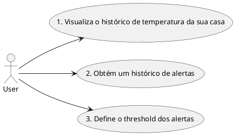
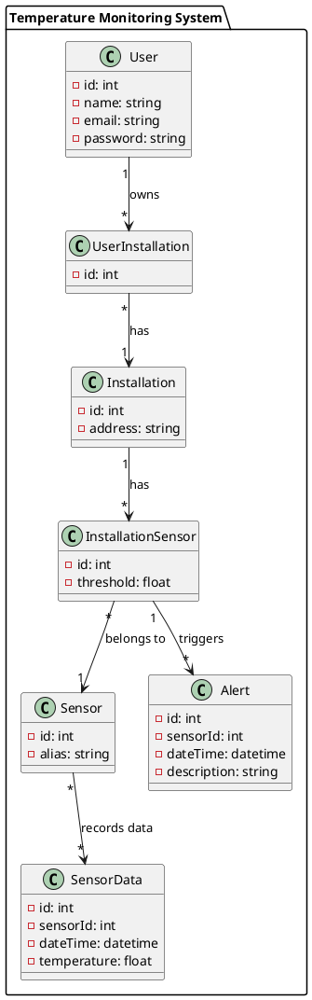
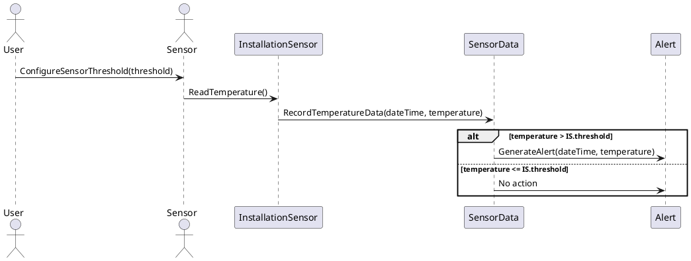

### Abimael Rocha de Albuquerque - 22007441
# Projeto : Dash-Home
Esse repositório contém os arquivos do Dash-Home, que consiste em um dispositivo IOT responsável por coletar dados de ambientes fechados e gerar valor ao usuário, podendo criar alertas, estatísticas e etc.

A documentação do artigo que descreve esse projeto podemos encontrar aqui: https://docs.google.com/document/d/1DPV7HK97PWqD4Y7E_DCAYi9PamALo6gnomxG9VfwCME/edit?usp=sharing

Link do repositório: https://github.com/Abimaelr/dash-home

# 1. Diagrama de caso de uso

# 2. Descrições de caso de uso

## 2.1 Visualiza o histórico de temperatura da sua casa

### Descrição:
Este caso de uso descreve a ação do usuário ao visualizar o histórico de temperatura da sua casa. O usuário pode acessar essa funcionalidade para acompanhar a variação da temperatura ao longo do tempo e analisar padrões ou anomalias.

### Pré-condições:

- O sistema deve ter registros históricos de temperatura da casa do usuário.
- O usuário deve estar autenticado no sistema.

### Fluxo Principal:

- O usuário acessa a opção de visualizar o histórico de temperatura da sua casa.
- O sistema exibe o histórico de temperatura em formato gráfico ou em uma lista ordenada por datas.
- O usuário pode interagir com o histórico, como aplicar filtros de data, zoom in/out, ou exportar os dados.

Pós-condições:
- O usuário tem acesso ao histórico de temperatura da sua casa para análise e referência futura.

## 2.2 Obtém um histórico de alertas

### Descrição:
Este caso de uso descreve como o usuário obtém um histórico de alertas gerados pelo sistema. Os alertas podem ser relacionados a eventos de temperatura fora do intervalo desejado, falhas de dispositivos ou outras situações relevantes.

### Pré-condições:

- O sistema deve ter registros de alertas gerados.
- O usuário deve estar autenticado no sistema.

### Fluxo Principal:

- O usuário acessa a opção de obter um histórico de alertas.
- O sistema exibe uma lista de alertas recentes ou permite aplicar filtros para encontrar alertas específicos.
- O usuário pode visualizar detalhes de cada alerta, como data/hora, descrição e ação tomada.

### Pós-condições:

- O usuário tem acesso ao histórico de alertas para revisão e análise de incidentes passados.

## 2.3 Define o threshold dos alertas

### Descrição:
Este caso de uso descreve como o usuário define o threshold (limite) para a geração de alertas pelo sistema. O threshold define os limites de temperatura que, quando ultrapassados, acionam um alerta para o usuário.

### Pré-condições:

- O usuário deve estar autenticado no sistema.
Deve existir uma configuração padrão ou inicial para o threshold, caso o usuário ainda não o tenha definido.

### Fluxo Principal:

- O usuário acessa a opção de definir o threshold dos alertas.
- O sistema exibe a configuração atual do threshold, se houver.
- O usuário pode modificar os valores de temperatura para definir novos limites de alerta.
- O sistema confirma a nova configuração do threshold após a confirmação do usuário.

### Pós-condições:

- O sistema utiliza o novo threshold definido pelo usuário para gerar alertas conforme as novas configurações.

# 3. Modelo de Domínio

# 4. Diagrama de sequencia

    
